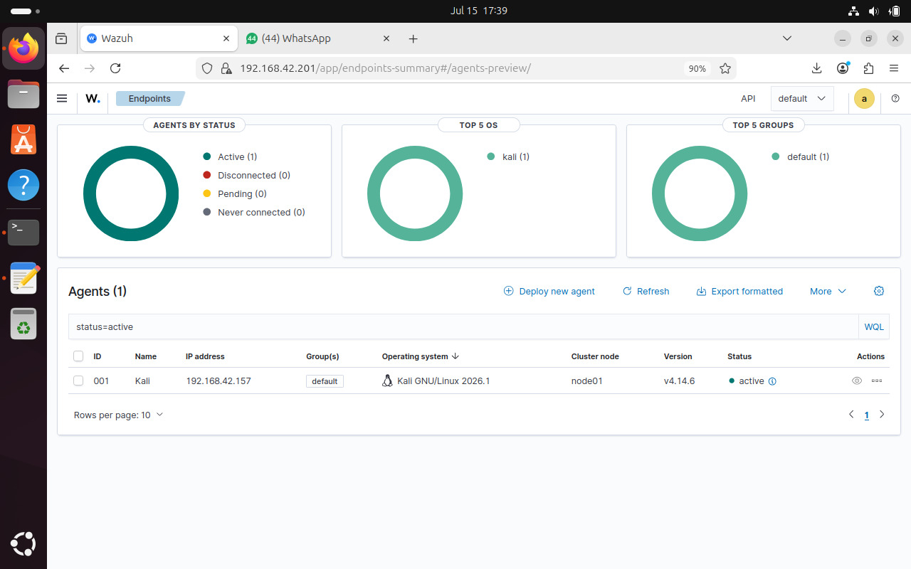
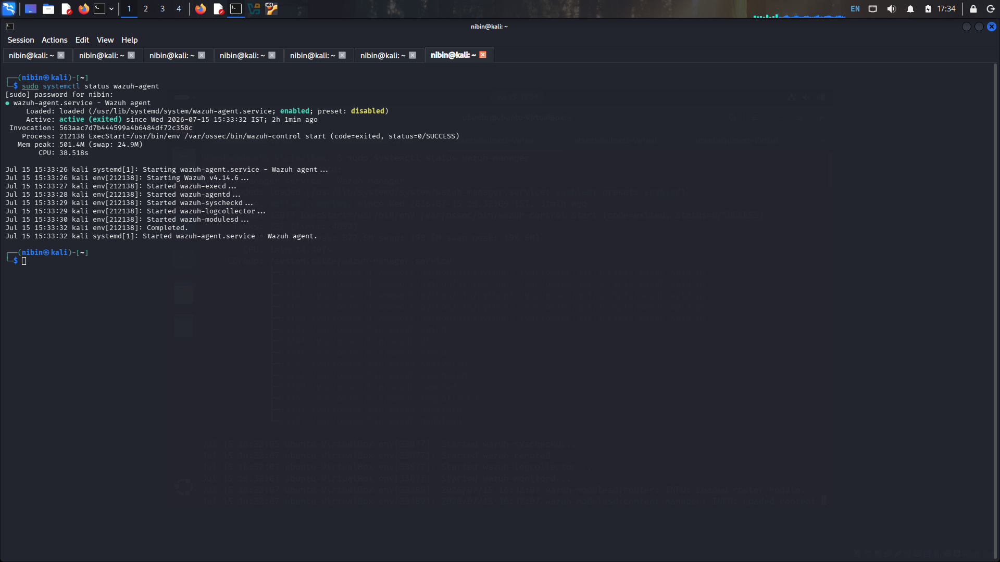
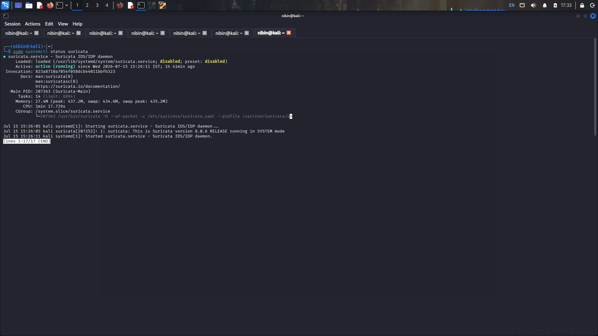
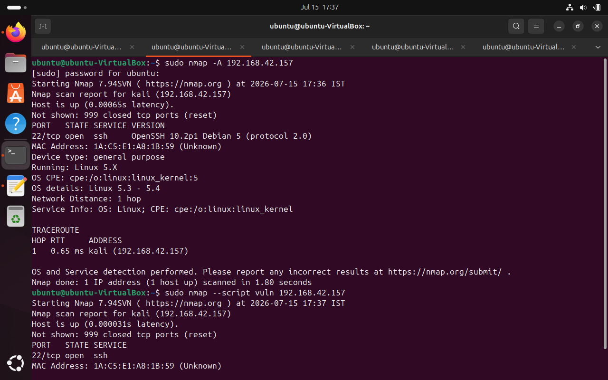
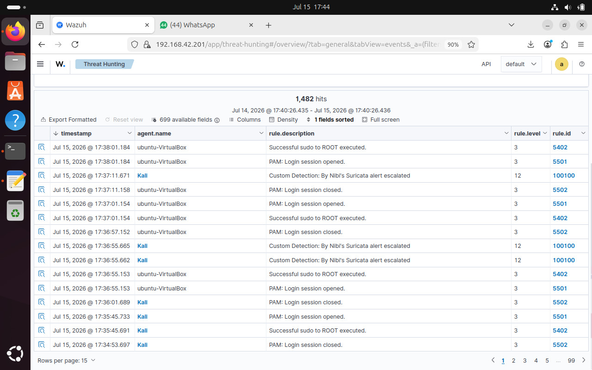
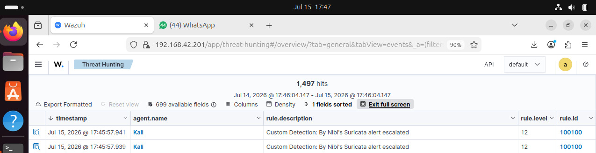

# Network Intrusion Detection System using Wazuh and Suricata

## Overview

This project demonstrates the integration of **Wazuh SIEM** with **Suricata IDS** to detect, monitor, and analyze network threats in real time. The project was implemented in a virtual lab environment using Ubuntu (Wazuh Manager) and Kali Linux (Wazuh Agent & Suricata).

## Objectives

- Install and configure Wazuh Manager and Dashboard.
- Deploy and configure a Wazuh Agent.
- Install and configure Suricata IDS.
- Integrate Suricata alerts with Wazuh.
- Generate test traffic using Nmap.
- Create and verify a custom Wazuh detection rule.

---

## Technologies Used

- Wazuh SIEM
- Suricata IDS
- Ubuntu Server
- Kali Linux
- Nmap
- VirtualBox

---

## Project Workflow

1. Install and configure Wazuh Manager.
2. Deploy the Wazuh Agent on Kali Linux.
3. Install and configure Suricata IDS.
4. Integrate Suricata `eve.json` logs with Wazuh.
5. Generate network traffic using Nmap.
6. Monitor alerts in Wazuh Threat Hunting.
7. Create and validate a custom detection rule.

---

# Screenshots

## Wazuh Dashboard

---

## Wazuh Agent Connected

---

## Suricata Service Running

---

## Nmap Scan for Alert Generation

---

## Threat Hunting Alerts

---

## Custom Detection Rule

---

## Project Report

The complete project documentation is available in:

📄 **report/Wazuh-Suricata-Project-Report.pdf**

---

## License

This project is licensed under the MIT License.
